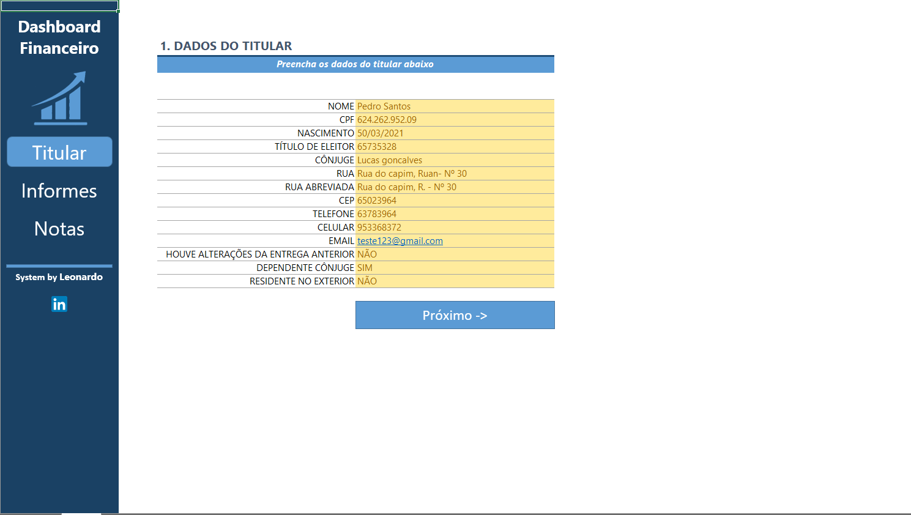
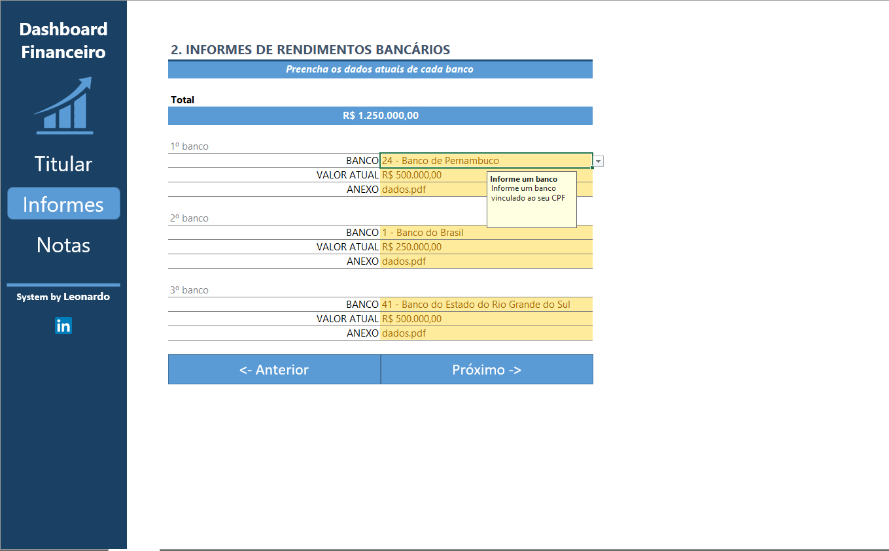
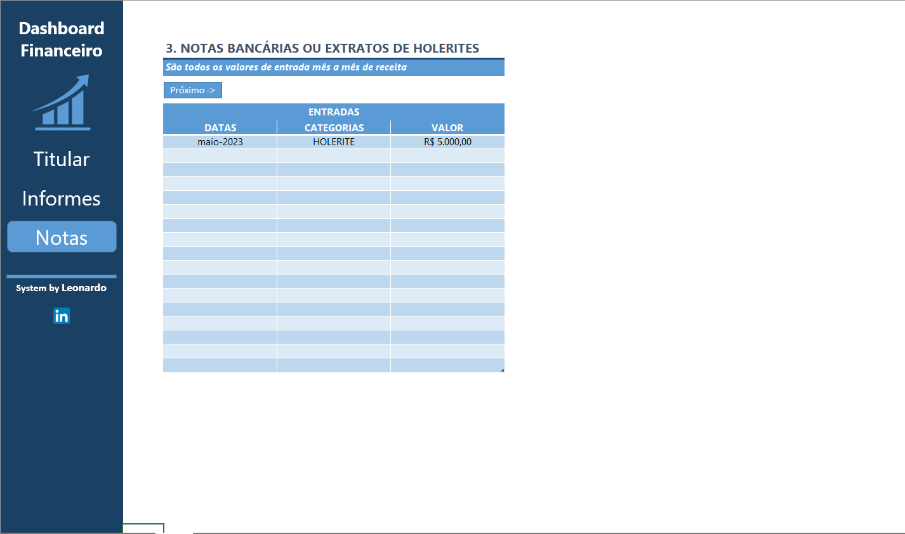

# Organizador_de_Declaracao_Imposto_de_Renda

Este projeto tem como objetivo o desenvolvimento de uma planilha em Excel voltada para a **organização e centralização de informações para a declaração do Imposto de Renda**.

A proposta é oferecer um **agregador de dados simples e funcional**, permitindo que o usuário registre e controle suas informações financeiras de maneira prática.
A ferramenta possui:
- Menus de navegação
- Validações automáticas de dados
- Funcionalidades auxiliares, como links rápidos

## 1ª Tela – Titular
Nesta aba, o usuário poderá preencher os **dados do titular da declaração**, focando nas principais informações pessoais para o preenchimento do Imposto de Renda.

  

## 2ª Tela – Informes
Na tela **Informes**, o usuário poderá registrar informações de **um ou mais bancos**, facilitando o controle dos rendimentos e a visualização do **total acumulado**.

  

## 3ª Tela – Notas
Na aba **Notas**, o usuário poderá registrar:
- Data da movimentação  
- Categoria  
- Valor de entrada da receita 
Essa organização permite no controle financeiro e na revisão dos dados para a declaração.

  

